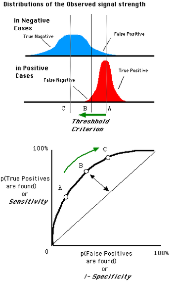

# 学习资料

机器学习术语 https://developers.google.cn/machine-learning/glossary/?hl=zh-CN

参考文章：https://blog.csdn.net/aws3217150/article/details/50479457

​			  https://smartse.github.io/group/%E8%B7%A8%E9%A1%B9%E7%9B%AE%E8%BD%AF%E4%BB%B6%E7%BC%BA%E9%99%B7%E9%A2%84%E6%B5%8B%E6%96%B9%E6%B3%95%E7%A0%94%E7%A9%B6%E7%BB%BC%E8%BF%B0.pdf


# 相关名词解释

###  benchmark  

	In computing, a benchmark is the act of running a computer program, a set of programs, or other operations, in order to assess the relative performance of an object, normally by running a number of standard tests and trials against it.[1] The term benchmark is also commonly utilized for the purposes of elaborately designed benchmarking programs themselves.（运行计算机程序，一组程序或其他操作，以评估对象的相对性能的行为，通常是通过运行多个标准测试和针对该对象的试验来进行评估。）

### CPDP
	跨项目软件缺陷预测

### F-Measure(F-Score)
https://zh.wikipedia.org/wiki/F-score
	是一种量测方法的精确度常用的指标，经常用于判断算法的精确度。目前在辨识、侦测相关的算法中经常回分别提到精确率（precision）和召回率（recall），而F-Score可以同时考虑这两个数值，平衡这个算法的精确度。
	

**一般式**							

###### 															

**β**是使用者自行定义的参数，由一般式可见F-score能同时考虑precision和recall这两种数值。分子为precision和recall相乘，根据这个式子，只要precision或recall趋近于0，F-score就会趋近于0，代表着这个算法的精确度非常低。一个好的算法，最好能够平衡recall和precision，且尽量让两种指标都很高。

### Precision和Recall权重一样时

一般上来说，提到F-score且没有特别的定义时，是指**β=1**时的F-score，亦有写作**F1-score**。代表使用者同样的注重precision和recall的这两个指标。其分数可以说是precision和recall的[调和平均](https://zh.wikipedia.org/wiki/調和平均)，式子如下：

​										


F-score最理想的数值是趋近于1，做法是让precision和recall都有很高的值。若两者皆为1，使得**2*（1/2）=1**，则F-score = 1 （100%），代表该算法有着最佳的精确度。

#### F-score的组成元素：


### TP, FN, FP, TN

- TP (true positive)：事实上为真，而且被我们的方法判断为真的情形
- FN (false negative)：事实上为真，却未我们的方法被判断为真的情形
- FP (false positive)：事实上不为真，却被我们的方法误判为真的情形
- TN (true negative)：事实上不为真，而且被我们的方法判断成不为真的情形

#### precision：


Precision的分母为两种**判断为真**的情形的总和

解释：当辨识结果为FP之后所付出的代价很高时，F-score应该着重此指标，亦即precision要很高。

例子：辨识电邮信箱里的垃圾邮件时，如果某封被误判成垃圾邮件（即FP）时，使用者可能就此错过重要的通知。

即错判成本高

#### recall:


Recall的分母为**事实上为真**的情形的总和

解释：当辨识结果为FN的代价很高时，F-score应该着重此指标，亦即recall要很高。

举例：一个传染病诊断辨识系统中，如果某个传染病患者被误判成阴性（即FN），当地的社区的居民就落入被传染的高风险之中。

举例：真正犯罪的人当中，有多少比例的罪犯被抓到。或，一张照片当中，有多少人脸被侦测到。

就是漏抓成本高


### G-measure


The G-measure is the geometric mean of Recall and Precision. Precision (also called positive predictive value) is the fraction of retrieved instances that are relevant, while recall (also known as sensitivity) is the fraction of relevant instances that are retrieved.


p为precision，r为recall


### ROC：

https://zh.wikipedia.org/wiki/ROC%E6%9B%B2%E7%BA%BF


在[信号检测理论](https://zh.wikipedia.org/wiki/信号检测理论)中，**接收者操作特征曲线**（**receiver operating characteristic curve**，或者叫**ROC曲线**）是一种坐标图

式的分析工具，用于

 (1) 选择最佳的信号侦测模型、舍弃次佳的模型。 

(2) 在同一模型中设定最佳阈值。在做决策时，ROC分析能不受成本／效益的影响，给出客观中立的建议。-


## ROC空间

ROC空间将伪阳性率（FPR）定义为 *X* 轴，真阳性率（TPR）定义为 *Y* 轴。

- TPR：在所有实际为阳性的样本中，被**正确地**判断为阳性之比率。

- FPR：在所有实际为阴性的样本中，被**错误地**判断为阳性之比率。

**给定**一个二元分类**模型**和它的**阈值**，就能从所有样本的（阳性／阴性）真实值和预测值计算出一个 (X=FPR, Y=TPR) 座标点。


从 (0, 0) 到 (1,1) 的对角线将ROC空间划分为左上／右下两个区域，在这条线的以上的点代表了一个好的分类结果（胜过随机分类），而在这条线以下的点代表了差的分类结果（劣于随机分类）。


**完美的预测**是一个在左上角的点，在ROC空间座标 (0,1)点，X=0 代表着没有伪阳性，Y=1 代表着没有伪阴性（所有的阳性都是真阳性）；也就是说，不管分类器输出结果是阳性或阴性，都是100%正确。

一个**随机的预测**会得到位于从 (0, 0) 到 (1, 1) **对角线**（也叫**无识别率线**）上的一个点；最直观的随机预测的例子就是抛硬币。


对应ROC图像


**点与随机猜测线的距离，是预测力的指标：离左上角越近的点预测（诊断）准确率越高。离右下角越近的点，预测越不准。**

在A、B、C三者当中，最好的结果是A方法。

B方法的结果位于随机猜测线（对角线）上，在例子中我们可以看到B的准确度（ACC，定义见前面表格）是50%。

C虽然预测准确度最差，甚至劣于随机分类，也就是低于0.5（低于对角线）。然而，当将C以 (0.5, 0.5) 为中点作一个镜像后，C'的结果甚至要比A还要好。这个作镜像的方法，简单说，不管C（或任何ROC点低于对角线的情况）预测了什么，就做相反的结论。


## ROC曲线

上述ROC空间里的单点，是给定分类模型且给定阈值后得出的。但同一个[二元分类模型](https://zh.wikipedia.org/w/index.php?title=二元分類模型&action=edit&redlink=1)的[阈值](https://zh.wikipedia.org/wiki/阈值)可能设定为高或低，每种阈值的设定会得出不同的FPR和TPR。

### **将同一模型每个阈值 的 (FPR, TPR) 座标都画在ROC空间里，就成为特定模型的ROC曲线。**

人体的血液蛋白浓度是呈正态分布的连续变数，病人的分布是红色，平均值为A [g](https://zh.wikipedia.org/wiki/公克)/[dL](https://zh.wikipedia.org/wiki/公升#公升配合國際單位制的詞頭)，健康人的分布是蓝色，平均值是C g/dL。健康检查会测量血液样本中的某种蛋白质浓度，达到某个值（阈值，threshold）以上诊断为有疾病征兆。研究者可以调整阈值的高低（将左上图的B垂直线往左或右移动），便会得出不同的伪阳性率与真阳性率，总之即得出不同的预测准确率。




### 1 由于每个不同的分类器（诊断工具、侦测工具）有各自的测量标准和测量值的单位（标示为：“健康人－病人分布图”的横轴），所以不同分类器的“健康人－病人分布图”都长得不一样。

### 2 **比较不同分类器时，ROC曲线的实际形状，便视两个实际分布的重叠范围而定，没有规律可循。**

### 3 但**在同一个分类器之内**，阈值的不同设定对ROC曲线的影响，仍有一些规律可循：

- ##### **当阈值设定为最高时**，亦即所有样本都被预测为阴性，**没有样本被预测为阳性**，此时在伪阳性率 FPR = FP / ( FP + TN ) 算式中的 FP = 0，所以 FPR = 0%。同时在真阳性率（TPR）算式中， TPR = TP / ( TP + FN ) 算式中的 TP = 0，所以 TPR = 0%


- ##### **当阈值设定为最低时**，亦即所有样本都被预测为阳性，**没有样本被预测为阴性**，此时在伪阳性率FPR = FP / ( FP + TN ) 算式中的 TN = 0，所以 **FPR = 100%**。同时在真阳性率 TPR = TP / ( TP + FN ) 算式中的 FN = 0，所以 **TPR=100%**


- ### 因为TP、FP、TN、FN都是累积次数，TN和FN随着阈值调低而减少（或持平），TP和FP随着阈值调低而增加（或持平），<u>*所以FPR和TPR皆必随着阈值调低而增加（或持平）</u>*。

  ### （即是**随着阈值调低，ROC点** 往右上（或右／或上）移动，或不动；但**绝不会往左下(或左／或下)移动**）


### AUC（ROC曲线下方的面积（英语：Area under the Curve of ROC (AUC ROC)）：

### 			意义：

- ##### 因为是在1x1的方格里求面积，AUC必在0~1之间。

- ##### 假设阈值以上是阳性，以下是阴性；

- ##### 若随机抽取一个阳性样本和一个阴性样本，分类器**正确判断**阳性样本的值高于阴性样本之**几率** {\displaystyle =AUC}[[1\]](https://zh.wikipedia.org/wiki/ROC曲线#cite_note-1)。

- ##### 简单说：**AUC值越大的分类器，正确率越高。**

  ### 从AUC判断分类器（预测模型）优劣的标准：

  ##### AUC = 1，是完美分类器，采用这个预测模型时，存在至少一个阈值能得出完美预测。绝大多数预测的场合，不存在完美分类器。

- ##### 0.5 < AUC < 1，优于随机猜测。这个分类器（模型）妥善设定阈值的话，能有预测价值。

- ##### AUC = 0.5，跟随机猜测一样（例：丢铜板），模型没有预测价值。

- ##### AUC < 0.5，比随机猜测还差；但只要总是反预测而行，就优于随机猜测。

  ### 计算:

  ##### **梯形法**（英语：trapezoid method）：简单地将每个相邻的点以直线连接，计算连线下方的总面积。因为每一线段下方都是一个梯形，所以叫**梯形法**。

  ##### 优点：简单，所以常用。

  ##### 缺点：倾向于低估AUC。

  #### ROC AUCH法....

  # 用python的 sklearn：绘制ROC曲线+求AUC

  求 ROC：`sklearn.metrics.roc_curve()`
  求 AUC：`sklearn.metrics.auc()`

  

  ```python
  import numpy as np
  from sklearn.metrics import roc_curve, auc
  
  y = np.array([1, 1, 1, 1, 1,
                2, 2, 2, 2, 2])
  y_proba = np.array([0.1, 0.4, 0.4, 0.3, 0.5,
                      0.4, 0.6, 0.7, 0.8, 0.5])   # probability of prediction as positive
  
  fpr, tpr, thresholds = roc_curve(y, y_proba, pos_label=2)
  auc = auc(fpr, tpr)
  ```

  ```python
  >>> fpr
  array([0. , 0. , 0.2, 0.6, 1. ])
  >>> tpr
  array([0.2, 0.6, 0.8, 1. , 1. ])
  >>> thresholds
  array([0.8, 0.6, 0.5, 0.4, 0.1])
  >>> auc
  >>> 0.9
  ```

  #### 直接求AUC

  也可以用 `sklearn.metrics.roc_auc_score()` 直接求得AUC

  ```python
  >>> import numpy as np
  >>> from sklearn.metrics import roc_auc_score
  >>> y_true = np.array([0, 0, 1, 1])
  >>> y_scores = np.array([0.1, 0.4, 0.35, 0.8])
  >>> roc_auc_score(y_true, y_scores)
  0.75
  ```


### MCC(马修斯相关系数 **Matthews correlation coefficient** (MCC) or **phi coefficient**)

https://en.wikipedia.org/wiki/Matthews_correlation_coefficient


A correlation of:
C = 1 indicates perfect agreement,
C = 0 is expected for a prediction no better than random, and
C = -1 indicates total disagreement between prediction and observation

就是说系数为1的时候，分类器是完美的，0的时候分类器和随机分类器没差，-1的时候分类器是最差的，所有预测结果和实际相反。

### 形式：


需要注意的是，分母中任意一对括号相加之和如果为0，那么整个MCC的值就为0。我们再回归我们的老问题，对于TP=98，TN=0，FN=0，FP=2，由于TN，FN同时为0，那么MCC则为0，说明我们简单粗暴的方式和随机分类器没有异同

MCC本质上是一个观察值和预测值之间的相关系数

While there is no perfect way of describing the confusion matrix of true and false positives and negatives by a single number, the Matthews correlation coefficient is generally regarded as being one of the best such measures


## Accuracy（准确率）

预测正确的结果占总样本的百分比，公式如下

* ##### **Accuracy = (TP+TN)/(TP+TN+FP+FN)**


## External Validity (外部效度)

https://zh.wikipedia.org/wiki/%E5%A4%96%E9%83%A8%E6%95%88%E5%BA%A6

#### 统计学术语，指实验结果类推到其他母体或环境的有效性（普遍适应性）

外部效度是基于特殊科学实验的处理外部有效性，而对实验能否可以类推到其他母体或环境的推断[[2\]](https://zh.wikipedia.org/wiki/外部效度#cite_note-2)[[3\]](https://zh.wikipedia.org/wiki/外部效度#cite_note-3)。较高的外部效度可视为：

1. 可以类推到实验的目标群体
2. 可以类推到与实验类似的其他群体


#### 影响因素

- 实验环境（Reactive effects of experimental arrangements）：[真实验](https://zh.wikipedia.org/w/index.php?title=真实验&action=edit&redlink=1)是在严格的控制条件下进行的，实验环境的人为性可能使某些实验结果难以用来解释普遍情况[[4\]](https://zh.wikipedia.org/wiki/外部效度#cite_note-A-4)。
- [选择](https://zh.wikipedia.org/wiki/选择)（The effects of selection）：被试背景的特定性可能使得[样本](https://zh.wikipedia.org/wiki/样本)很难代表[母体](https://zh.wikipedia.org/wiki/母體)[[4\]](https://zh.wikipedia.org/wiki/外部效度#cite_note-A-4)。
- 测量工具：实验者对实验中变量的操作定义往往以测量工具为基准，而实验材料和测验类型的差异可能使实验结论产生错误。
- [构想效度](https://zh.wikipedia.org/w/index.php?title=构想效度&action=edit&redlink=1)：关于关系变量及变量之间关系构想的准确性，以及实验变量在实验时的操作定义与推理时的定义的一致性程度。


## cross-validation(交叉验证)

https://zh.wikipedia.org/wiki/%E4%BA%A4%E5%8F%89%E9%A9%97%E8%AD%89#cite_note-Kohavi95-1

https://en.wikipedia.org/wiki/Cross-validation_(statistics)

辅助参考：https://blog.csdn.net/zxyhhjs2017/article/details/79074812

​			 https://blog.csdn.net/VIP_WangSai/article/details/85013992

​			https://www.zhihu.com/question/39259296

**交叉验证**，有时亦称**循环估计**[[1\]](https://zh.wikipedia.org/wiki/交叉驗證#cite_note-Kohavi95-1) [[2\]](https://zh.wikipedia.org/wiki/交叉驗證#cite_note-Chang92-2) [[3\]](https://zh.wikipedia.org/wiki/交叉驗證#cite_note-Devijver82-3)， 是一种[统计学](https://zh.wikipedia.org/wiki/統計學)上将[数据](https://zh.wikipedia.org/wiki/数据)[样本](https://zh.wikipedia.org/wiki/樣本)[切割](https://zh.wikipedia.org/wiki/集合划分)成较小子集的实用方法。可以先在一个子集上做分析，而其它子集则用来做后续对此分析的确认及验证。一开始的子集被称为**训练集**。而其它的子集则被称为**验证集**或**测试集**。交叉验证的目的，是用尚未用来给模型作训练的新数据，测试模型的性能，以便减少诸如过拟合和选择偏差等问题，并给出模型如何在一个独立的数据集上通用化（即，一个未知的数据集，如实际问题中的数据）

假设有个未知模型具有一个或多个待定的参数，且有一个数据集能够反映该模型的特征属性（训练集）。适应的过程是对模型的参数进行调整，以使模型尽可能反映训练集的特征。如果从同一个训练样本中选择独立的样本作为验证集合，当模型因训练集过小或参数不合适而产生过拟合时，验证集的测试予以反映。 交叉验证是一种预测模型拟合性能的方法。


### Transfer Learning(迁移学习)

https://en.wikipedia.org/wiki/Transfer_learning

https://zh.wikipedia.org/wiki/%E8%BF%81%E7%A7%BB%E5%AD%A6%E4%B9%A0

https://www.zhihu.com/question/41979241

**迁移学习** 是属于机器学习的一种研究领域。它专注于存储已有问题的解决模型，并将其利用在其他不同但相关问题上。[[1\]](https://zh.wikipedia.org/wiki/迁移学习#cite_note-1) 比如说，用来辨识汽车的知识（或者是模型）也可以被用来提升识别卡车的能力。


### CrossPare

​	https://github.com/zzh-www/CrossPare

本文作者实现的跨项目软件缺陷预测实验工具包

CrossPare is a tool designed for the execution of cross-project defect prediction experiments. It implements many techniques proposed by different research groups across the world.

CrossPare uses a mark-up style definition of experiments. In the end, it is a quite simple definition of an XML file. The XML file defines the following.

- where the data for the experiment is stored and how it is loaded
- how the data shall be processed prior the the training of a prediction model
- the training of prediction models
  - it is possible to train and evaluate multiple prediction models with the same XML configuration file. Then all models use the same data processing steps.
- where and how the results shall be stored
  - CrossPare currently supports MySQL databases and CSV files.


### R 

官网：https://www.r-project.org/

教程：https://www.math.pku.edu.cn/teachers/lidf/docs/Rbook/html/_Rbook/intro.html

####  R语言一般特点

- 自由软件，免费、开放源代码，支持各个主要计算机系统；
- 完整的程序设计语言，基于函数和对象，可以自定义函数，调入C、C++、Fortran编译的代码；
- 具有完善的数据类型，如向量、矩阵、因子、数据集、一般对象等，支持缺失值，代码像伪代码一样简洁、可读;
- 强调交互式数据分析，支持复杂算法描述，图形功能强;
- 实现了经典的、现代的统计方法，如参数和非参数假设检验、线性回归、广义线性回归、非线性回归、可加模型、树回归、混合模型、方差分析、判别、聚类、时间序列分析等。
- 统计科研工作者广泛使用R进行计算和发表算法。R有上万软件包(截止2019年7月有一万四千多个)。


ANOVA with Scott-Knott clustering


# 正文学习


### A Comparative Study to Benchmark Cross-project Defect Prediction Approaches

以标准检查程序测试CDPD（跨项目软件缺陷预测）方法的比较研究         （a benchmark for CPDP）


#### 作者  Steffen Herbold,   Alexander Trautsch,   Jens Grabowski

​	近年来，跨项目缺陷研究（CPDP）作为一种聚焦于软件项目质量保证的方法，备受关注。然而，在现有的先进技术中还不明确哪一种是最好的方案，这是因为缺乏结果的复制和不同的实验设置基于不同的基础数据（数据）并且 使用不同的性能指标。在这篇文章的[2,3]中，我们为CDPD提供了一种标准检查程序。我们的标准检查程序复现了从2008年到2015间研究人员提出的24种CDPD方法。通过我们的标准检查程序测试，我们回答了下面几个研究问题：

##### 	·RQ1: 依据F-measure，G-measure，AUC 和 MCC 哪种 CDPD方法表现得最好？

##### 	·RQ2：有没有CPDP方法能一致地满足Zimmerman等人假设的可以称为预测成功的性能标准（即是至少 precision为0.75，recall为0.75 和 accuracy为0.75 ）？

##### 	·RQ3: 只使用具有一定平衡性（至少5％的缺陷示例和至少5％的无缺陷示例例）的大量产品[大数据集？]（大于一百示例） 对 标准检查程序测试（基准测试）			 结果 有什么影响？

##### 	·RQ4：使用较大数据集的较小子集对标准检查程序（基准）测试结果有什么影响

我们确定了5个公共数据集，其中包含有关我们用来回答这些研究问题的86种软件产品的缺陷数据。

使用多个数据集的优势在于我们可以增加软件数目从而提高我们结果的外部效应（普遍适应性）

而且，我们希望使用多种性能指标评估CPDP方法。因此，RQ1不是仅用一种标准而是使用四种性能标准(AUC,F-measure，G-measure和MCC)对方案排名。

现有的对不同方案进行统计排序的方法既不考虑来自不同数据集的软件产品，也不考虑多个性能指标。因此，我们确定了一种方法可以将根据不同性能标准和数据集的独立排名统一成一个共同的排名。


## Figure 1: Mean rank score over all data sets for the metrics AUC, F-measure, G-measure, and MCC. In case multiple classifiers were used, we list only the result achieved with the best classifier.

​	


图表一描述了RQ1的结果，这说明了Camargo Cruz and Ochimizu提议的方法表现得最好甚至由于交叉验证（cross-validation 或 CV）*？？*

而且，我们的结果显示24中方法中只有6种优于我们的基准线之一即使用所有数据进行培训，而无进行任何迁移学习。

关于RQ2，我们断定预测方法只有很少能够达到075的召回率，精度和准确率的高性能。

在86种软件中，CPDP只对其中四种软件能够达到标准，即当中的4.6%。因此，CPDP依旧没有达到能够在实际应用所需要的性能要求（因此，CPDP仍未达到结果的性能足以在实践中应用的地步）。

RQ3和RQ4是用来检验结果是否受到子集数据的影响，就像缺陷预测实验经常做的那样。

对于RQ3，就是使用一个大数据集子集，我们断定使用整个数据集和使用其子集是完全相同的。

对于RQ4，就是使用小数据集子集，我们发现在性能报告上存在高达5%的统计差异。因此，应该避免使用小数据集。


# 代码实现：

## 代码地址

https://github.com/sherbold/replication-kit-tse-2017-benchmark


### requirements

- MySQL
- Java 8
- R 3.3.2
- Optional: JDK and Ant for compilation of the source code.
- Tested on Windows 10, but does not contain OS specific code.


### Contents

1. additional-visualizations folder(附加可视化文件夹) 带有临界距离图 和 箱型图， 文章不包含这些图表

2. #### benchmark-execution folder(基准测试执行文件) 包含所有 执行基准测试 和 复制结果所需要的文件

3. ### R-scripts folder（R语言脚本文件）包含 评估结果 和 生成 图像的脚本

   

4. sql folder（数据库文件）包含 为基准测试结果设置 初始本地MySQL数据库的数据库源码

5. raw-results folder(原始结果文件夹) 包含 以CSV文件存储的 基准测试原始结果

   

### How to use

有三种方法使用此复现工具包

1. 查看附加可视化文件。 只要下载文件夹打开  boxplots.html 或者 cd-diagrams.html 文件即可
2. 获得基准测试原始数据。 你可以直接使用 [raw CSV data](./benchmark/benchmark/raw-results/crosspare-results-replication-kit.csv) 或者将数据导入到数据库中
3. 复现基准测试结果（运行评估脚本  进行统计测试（统计结果） 和 为结果绘图）


下面我们将解释：

- 如何为使用这个复现工具包设置你的本地MySQL数据库
- 如何将原始基准测试结果（数据？）导入到MySQL数据库
- 如何复现原始结果（数据）
- 如何运行评估脚本


### 设置初始数据库：

***


1. 下载MySQL，任意版本
2. 创建一个数据库命名为 “crosspare”
3. 创建一个用户和密码均为“crosspare”的用户
4. 运行[setup-db.sql](./benchmark/benchmark/sql/setup-db.sql)脚本里的SQL语句创建 results表 和 resultsView 视图

也可以使用其他数据库名称、用户名和密码。在这种情况下，必须使用 [mysql.cured](./benchmark/benchmark/benchmark-execution/mysql.cred) 来执行基准测试和R脚本开始处的全局变量，以进行评估和图生成。

数据库包含比论文更多的指标项，其中包括：

- error rate（错误率）
- true negative rate （TN 真阴性率）
- the confusion matrix itself (tp, fp, tn, fn columns) （混淆矩阵本身）

数据中还有其他几列，但是，由于它们是实验性的且未经适当测试，因此应将其忽略。

Most of them result rather from testing what is possible with **CrossPare** and where hacked in rather quickly without any double checking, e.g., AUCEC to see if the evaluation framework would be able to take effort into account. However, this works only for some data sets, and even there it is still buggy. Please also note that this comment holds only for the version of CrossPare contained in the replication package. Further development since April 2017 may have fixed, removed or added the calculation of metrics.


#### Raw benchmark results（原始基准测试结果）

***

原始数据有两种格式：

- [db-inserts.sql](./benchmark/benchmark/raw-results/db-inserts.sql) SQL脚本 使用SQL 插入语句  填写 results表格
- [crosspare-results-replication-kit.csv](./benchmark/benchmark/raw-results/crosspare-results-replication-kit.csv)  CSV文件，用于使用原始结果而无需MySQL数据库


### Replicate raw results（复现原始结果）

***

我们也可以执行基准测试（标准检查程序）从头开始 复现所有原始结果（原始数据）

实现复现，你可以简单地运行Linux或者window 批处理脚本。 ***请注意 他们会尝试 创建 可以访问大约30GB内存的JVM（Java虚拟机），有时候，30GB还不够，在这种情况下进程（execution）会直接崩溃。 ***   然而，你可以直接重启 进程（程序）结果的计算将从停止的地方继续。 唯一能够完全解决崩溃的办法就是增加内存。

请注意，如果数据库中已经填充了我们提供的原始结果，则执行完整基准测试将不起作用。理想情况下，什么也不会发生，因为基准测试执行会检查哪些结果已经可用，并且只执行丢失的部分。由于My SQL数据库有时会拒绝连接，因此执行可能会崩溃。发生这种情况是因为快速检查了结果是否可用，如果数据库已被填充，它将在几秒钟内导致数千个查询。

复现包使用 [CrossPare](https://github.com/sherbold/CrossPare/) 工具。 CrossPare 实现 许多为 跨项目缺陷预测  建议的方法 并且支持 从公开数据集种加载数据。 这个实验本身 是使用 XML 文件 配置的， XML文件描述了 加载什么数据 和 决定 如何训练缺陷预测模型。
所有的实验配置都被包含在 [config folder](./benchmark/benchmark/benchmark-execution/benchmark/config) 文件夹中   
[config-infeasible](./benchmark/benchmark/benchmark-execution/benchmark/config-infeasible)文件夹包含由于内存和运行时限制而无法执行的配置。

[crosspare.jar](./benchmark/benchmark/benchmark-execution/crosspare.jar) 获得 配置文件夹的路径作为参数 并且加载所有实验配置。 然后，这些实验配置就会被执行。这个实验本身几乎只使用 一个CPU。 然而， CrossPare 是 通过 利用所有的CPU核心 并行 执行多个实验 的方式 实现的。 因此， 所有CPU利用率 在实验（基准测试运行）的时候 都会达到100% 。 因为 实验配置的巨大数量，所以实验可能会持续几周。
你可以使用 [exec_all](./benchmark/benchmark/benchmark-execution/exec_all.sh) 脚本去执行所有实验  或者 修改 [exec_single_config](./benchmark/benchmark/benchmark-execution/exec_single_config.sh) 脚本 去 只执行一个实验配置

执行的结果将会被存储到MySQL数据库中。另外，results-csv文件夹中·包含了 每一个实验配置的 即时CSV输出。然而这些CSV的值会被覆盖 并且 如果 crosspare 崩溃 可能会导致文件无效。另一方面，My SQL数据库始终保持一致。


### Run evaluation scripts (运行评估脚本)

***

复现工具包也包含了我们评估结果的脚本。 脚本包含R语言代码。 我们需要使用 RStudio 来运行代码。 这个脚本将会尝试 从CRAN 下载一些 库。  确保您具有Internet连接并且在R环境中正确配置了CRAN镜像。

所有脚本都允许自定义结果生成的路径，即，图和表。 在执行代码之前，请确保文件夹存在，因为R脚本不会自动生成这些文件夹。

[generate_results.R](./benchmark/benchmark/R-scripts/generate_results.R) 对 我们基准测试生成的大多数初始数据进行分析。脚本包含 结果的统计学比较逻辑 ， 和生成文章里的所有图表和results表。 在文件的开头， 全局变量定义了执行的一些选项，例如， 是否生成图表， 存储在哪里 和 数据库连接的细节。

另外，[generate_htmlplots.R](./benchmark/benchmark/R-scripts/generate_htmlplots.R)   包含生成 复现工具包中箱型图的代码。 与上相同 该脚本在脚本的开头还包含一些全局变量，用于描述My SQL数据库的连接详细信息。


# Building CrossPare from Source（从源码构建CrossPare）

***

[crosspare-src](./benchmark/benchmark/crosspare-src)文件夹中的复制工具包中提供了Cross Pare的源代码。可以使用提供的Ant脚本通过调用“ ant dist”来构建crosspare.jar文件。然后，构建结果将出现在文件夹“ dist”中。源代码等于版本cf4239f689d315c9cf84e4c05287006c673dc911。


# License

***

This replication package and CrossPare are licensed under the Apache License, Version 2.0.


### 我的复现过程:

​			由于原始数据的获得时间过于漫长就不从头实现

1. 按照步骤设置好数据库后运用navigator运行[setup-db.sql](./benchmark/benchmark/sql/setup-db.sql)与 [db-inserts.sql](./benchmark/benchmark/raw-results/db-inserts.sql)  获得原始数据
2. 下载 [R](http://mirror.bjtu.edu.cn/cran/) 与 [RStudio](https://www.rstudio.com/) 而后运行 [generate_results.R](./benchmark/benchmark/R-scripts/generate_results.R) 脚本 获得以下结果


3. 运行 [generate_htmlplots.R](./benchmark/benchmark/R-scripts/generate_htmlplots.R) 运行之前请将存储路径改为绝对路径并确保文件存在 PLOT_PATH = "D:\\RSOURECE\\html_figures\\"  可以得到一堆 html 文件


#### 查看代码[generate_results.R](./benchmark/benchmark/R-scripts/generate_results.R)

​	默认设置NONPARAMETRIC为TRUE 即使用  Friedman-Nemenyi 排序


更改设置NONPARAMETRIC为FALSE 即使用Scott-Knott聚类方差分析方法 排序


